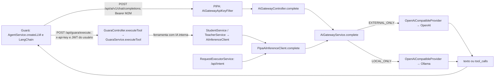

# PIPA - Plataforma integrada personalizável para assistentes

**PIPA** é uma plataforma digital desenvolvida com **Spring Boot**
que fornece um meio pelo qual instituições parceiras pode integrar os seus sistemas
académicos ou bases de dados por meio de provedores com assistentes digitais.
---

## Arquitetura do Sistema
- Cada projeto/módulo da PIPA possui responsabilidade bem definida e tecnologias específicas

### Visão Geral dos Módulos

| Projeto           | Responsabilidade                                           |
|-------------------|------------------------------------------------------------|
| `API_AI`          | Módulo JAR de comunicação com a OpenAI via Spring AI       |
| `AUTH_SERVER`     | Servidor de autorização e emissão de JWT                   |
| `PIPA`            | Núcleo de domínio e orquestração das intenções do usuário  |
| `PIPA_MIDDLEWARE` | Configuração de filtros JWT                                |
| `PIPA_INTEGRATOR` | Contratos e interfaces para provedores                     |
| `UEG_PROVIDER`    | Provedor de serviços reais usados no estudo de caso da UEG |
| `PIPA_EMAIL`      | Envio de emails                                            |

---

## Detalhamento dos Projetos

### API_AI

Módulo JAR responsável pela comunicação entre a plataforma e a **OpenAI**, permitindo integração com modelos de linguagem como o ChatGPT. Embora possua dependências Spring Web e WebFlux, o código atual não contém controller nem endpoint REST; suas classes são consumidas diretamente pelos demais módulos Java.

**Tecnologias utilizadas:**
- `spring-ai-starter-model-openai:1.0.0-SNAPSHOT`
- `spring-ai-bom:1.0.0-SNAPSHOT`
- `jackson-databind`

---

### AUTH_SERVER

Servidor de autorização central, encarregado da autenticação dos usuários e emissão de **tokens JWT**.

**Tecnologias utilizadas:**
- `spring-boot-starter-thymeleaf`
- `spring-boot-starter-validation`
- `io.jsonwebtoken:jjwt-api`, `jjwt-impl`, `jjwt-jackson` (`0.12.5`)

---

### PIPA

Responsável pelo **domínio do sistema** e pela orquestração dos módulos da plataforma. O fluxo standalone em `/api/intent` processa a intenção com `RequestExecutorService` e `AiInferenceClient`. Na integração com o Guará, o PIPA descobre e executa ferramentas de forma determinística pelos endpoints `/api/guara/**`; a seleção conversacional da ferramenta permanece no LangChain do Guará. A inferência do agente passa por `POST /api/ai/v1/chat/completions`, que seleciona o provedor conforme `AI_ROUTING_MODE`.

#### Gateway de inferência Guará → PIPA

`EXTERNAL_ONLY` encaminha as chamadas do agente e da IA interna à OpenAI; `LOCAL_ONLY` encaminha-as ao modelo local configurado em Ollama. Os dois modos não fazem fallback cruzado. `HYBRID` é reservado para uma etapa posterior e impede a inicialização se selecionado. A rota é não-streaming, aceita o subconjunto de chat completions usado pelo Guará e preserva texto, `tool_calls`, IDs e `usage` quando o provedor fornece esses campos. O corpo da conversa não é registrado pelo gateway.

| Classe | Responsabilidade |
|---|---|
| `AiGatewayController` | Expõe `POST /api/ai/v1/chat/completions` e devolve a resposta do provedor com rota efetiva em headers. |
| `AiGatewayService` | Valida o pedido, fixa o modo configurado, substitui o alias pelo modelo real, chama o provedor e registra metadados sem conteúdo. |
| `PipaAiInferenceClient` | Implementa `AiInferenceClient`: monta mensagens e JSON Schema, chama o gateway em memória e rejeita texto vazio/truncado. |
| `RequestExecutorService` | Usa `AiInferenceClient` para saudação, plano JSON e formatação de `/api/intent`, sem logar prompt ou parâmetros. |
| `AiGatewayProperties` | Recebe modo, URLs, modelos, segredo M2M e timeout da configuração. |
| `ChatCompletionProvider` | Contrato interno de inferência usado pelo gateway. |
| `OpenAiCompatibleProvider` | Transporta chat completions não-streaming para endpoint local ou externo compatível. |
| `AiGatewayApiKeyFilter` | Compara em tempo constante o Bearer M2M da rota de IA; não interpreta esse valor como JWT acadêmico. |
| `SecurityConfig` | Aplica cadeia dedicada à rota de IA; mantém a cadeia JWT das rotas existentes separada. |

**Limite atual do modo local:** `StudentService`, `TeacherService` e `/api/intent` usam agora o gateway compartilhado; `LOCAL_ONLY` não faz fallback externo nessas inferências. Ainda faltam teste ponta a ponta com Ollama real e auditoria de outros caminhos de IA, especialmente transcrição de áudio, antes de afirmar isolamento global. O fluxo versionado está em [FLUXOv3.MD](../../FLUXOv3.MD).

O núcleo também contém a base de observabilidade: `UserSession`, `ToolExecutionLog`, `ObservabilityService`, `ObservabilityExportService`, `ObservabilitySessionScheduler`, `ProviderFailureResolver` e os endpoints `GET /api/observability/logs`, `/filters`, `/dashboard` e `/export`. A listagem acumula filtros por Spring Data JPA `Specification` e retorna `PageResponseDTO<ObservabilityLogDTO>` sem usuário, fingerprint, mensagem ou stack trace; as opções são distintas e ordenadas; a visão geral agrega cards e séries; a exportação gera CSV ou PDF somente a partir do DTO seguro. O Core mede `durationMs` no envelope completo, classifica falhas por etapa e mantém sessões históricas conforme o TTL, com atualização de atividade, renovação, scheduler e locking pessimista. Dashboard Next.js e proteção administrativa específica ainda não estão implementados.

**Tecnologias utilizadas:**
- `spring-boot-starter-data-jdbc`
- `spring-boot-starter-data-jpa`
- `mapstruct:1.5.5.Final`
- `springdoc-openapi-starter-webmvc-ui:2.0.4`
- `org.reflections:reflections:0.10.2`
- `org.postgresql:postgresql`

**Módulos internos:**
- `apiai:0.0.1-SNAPSHOT`
- `PIPA_INTEGRATOR:0.0.1-SNAPSHOT`
- `UEG_PROVIDER:0.0.1-SNAPSHOT`
- `PIPA_MIDDLEWARE:0.0.1-SNAPSHOT`
- `PIPA_EMAIL:0.0.1-SNAPSHOT`

---

### PIPA_MIDDLEWARE

Responsável por **receber e validar tokens JWT**, servindo como camada de proteção entre os consumidores externos e os serviços da plataforma.

**Tecnologias utilizadas:**
- `spring-boot-starter-oauth2-client`
- `spring-boot-starter-oauth2-resource-server`
- `spring-boot-starter-security`
- `spring-security-oauth2-jose`

---

### PIPA_INTEGRATOR

Define os **contratos e interfaces** obrigatórios para que qualquer provedor de serviço (como UEG_PROVIDER) possa ser conectado à plataforma.

**Tecnologias utilizadas:**
- `gson:2.10.1`
- `lombok:1.18.30`

**Módulo interno:**
- `apiai:0.0.1-SNAPSHOT`

---

### UEG_PROVIDER

Módulo do estudo de caso com a **Universidade Estadual de Goiás (UEG-CET)**. Fornece os serviços institucionais integrados à PIPA, consulta de aulas e notas.

**Tecnologias utilizadas:**
- `joda-time:2.12.7`
- `reflections:0.10.2`
- `flying-saucer-pdf:9.9.4`
- `apache-httpclient:5.1.3`
- `jtiddy:r938`
- `simple-java-mail:8.12.2`

**Módulos internos:**
- `apiai:0.0.1-SNAPSHOT`
- `PIPA_INTEGRATOR:0.0.1-SNAPSHOT`
- `PIPA_EMAIL:0.0.1-SNAPSHOT`

---

### Como rodar o projeto

Para um passo a passo de importação dos repositórios separados no IntelliJ, instalação dos módulos Maven, configuração do PostgreSQL/JWT e inicialização do Core e Auth Server, consulte [Como rodar o PIPA no IntelliJ](../COMO_RODAR_NO_INTELLIJ.md).

Clone os repositórios
* `https://github.com/Plataforma-Universitaria/API_IA`
* `https://github.com/Plataforma-Universitaria/PIPA`
* `https://github.com/Plataforma-Universitaria/PIPA_INTEGRATOR`
* `https://github.com/Plataforma-Universitaria/UEG_PROVIDER`
* `https://github.com/Plataforma-Universitaria/PIPA_MIDDLEWARE`
* `https://github.com/Plataforma-Universitaria/AUTH_SERVER`
* `https://github.com/Plataforma-Universitaria/PIPA_EMAIL`

---

## Configure as variáveis de ambiente
#### Para o uso legado da API_AI (opt-in)

O `AIClient` do PIPA_INTEGRATOR só é registrado com `ai.legacy.enabled=true`. Não é usado pelo fluxo atual do PIPA; o Core desativa a autoconfiguração Spring AI de chat, embedding, imagem, transcrição, síntese de fala e moderação por `spring.ai.model.*=none` nas configurações local e Docker. Isso evita que os modelos OpenAI não usados exijam `OPENAI_API_KEY` ao iniciar em `LOCAL_ONLY`. O gateway continua configurado por `AI_ROUTING_MODE`, `AI_LOCAL_*` ou `AI_EXTERNAL_*`/`OPENAI_API_KEY`. Se o legado for ativado, ele lê:

* `spring.ai.openai.api-key`
* `spring.ai.openai.chat.options.model`

#### Para o uso do AUTH_SERVER

O `application.properties` do Auth Server fixa `server.port=9090` e lê:

* `ROOT_URL_AUTH`
* `ROOT_URL_LOGOUT`
* `ROOT_URL_SALUTATION`
* `ROOT_URL_INSTITUTIONS`
* `PRIVATE_KEY`
* `EXP_TIME`
* `ISSUER`
* `CALLBACK`

#### Para a PIPA

O `application.properties` atual lê as seguintes variáveis de ambiente:

* `OPENAI_API_KEY` (necessária somente em `EXTERNAL_ONLY`)
* `OPENAI_API_MODEL` (opcional; padrão `gpt-4o-mini` em `EXTERNAL_ONLY`)
* `AI_ROUTING_MODE` (`EXTERNAL_ONLY` por padrão; `LOCAL_ONLY` disponível; `HYBRID` ainda indisponível)
* `AI_GATEWAY_SERVICE_KEY` (segredo de pelo menos 32 caracteres, igual a `GUARA_AI_GATEWAY_KEY` no Guará; ausente ou curto faz a rota responder 401)
* `AI_LOCAL_BASE_URL` (padrão `http://localhost:11434/v1`; endereço visto pelo processo PIPA)
* `AI_LOCAL_MODEL` (obrigatório em `LOCAL_ONLY`)
* `AI_EXTERNAL_BASE_URL` (padrão `https://api.openai.com/v1`)
* `AI_GATEWAY_TIMEOUT` (padrão `90s`)
* `DB_ADDRESS`
* `DB_USER`
* `DB_PASSWORD`
* `PUBLIC_KEY`
* `EMAIL_HOST`
* `EMAIL_PORT`
* `EMAIL_APP_PW`
* `EMAIL`
* `USER_ADMIN`
* `USER_PASS`

Além disso, `root.package` está definido como `br.ueg.tc.` e `guara.api-key` está configurada diretamente no `application.properties` atual.

`PUBLIC_KEY` é a chave pública correspondente à `PRIVATE_KEY` usada pelo Auth Server para assinar os JWTs. O Auth Server mantém `PRIVATE_KEY` e define `ISSUER`; consumidores como a PIPA e o Guará validam os tokens com a chave pública. No Guará, configure `GUARA_JWT_PUBLIC_KEY` com o mesmo valor de `PUBLIC_KEY` e `GUARA_JWT_ISSUER` com o valor exato de `ISSUER`. Nunca copie `PRIVATE_KEY` para a PIPA ou para o Guará.

Nos endpoints `/api/guara/tools/{userExternalId}` e `/api/guara/execute/{toolName}/{userExternalId}`, `GuaraController` exige tanto a API key validada por `GuaraApiKeyFilter` quanto um JWT Bearer validado pelo Spring Security. O `sub` do JWT deve ser igual ao `userExternalId` da rota. `GET /api/guara/tools/guest` continua usando apenas a API key. Isso permite que `PublicService` e outros serviços obtenham o usuário autenticado pelo `SecurityContext`, inclusive ao consultar ou gravar anotações. Ausência de JWT retorna 401; identidade divergente retorna 403.

## Rode o comando maven na seguinte ordem

* `API_AI`
* `PIPA_INTEGRATOR`
* `PIPA_EMAIL`
* `PIPA_MIDDLEWARE`
* `UEG_PROVIDER`
* `PIPA`
* `AUTH_SERVER`
